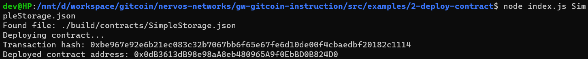

# Deploy A Simple Ethereum Smart Contract On Polyjuice

Task URL : https://gitcoin.co/issue/nervosnetwork/grants/3/100026209

## Screenshot of the console output immediately after smart contract is successfully deployed.



## Transaction Hash

```
0xbe967e92e6b21ec083c32b7067bb6f65e67fe6d10de00f4cbaedbf20182c1114
```

## Deployed Contract Address

```

```
