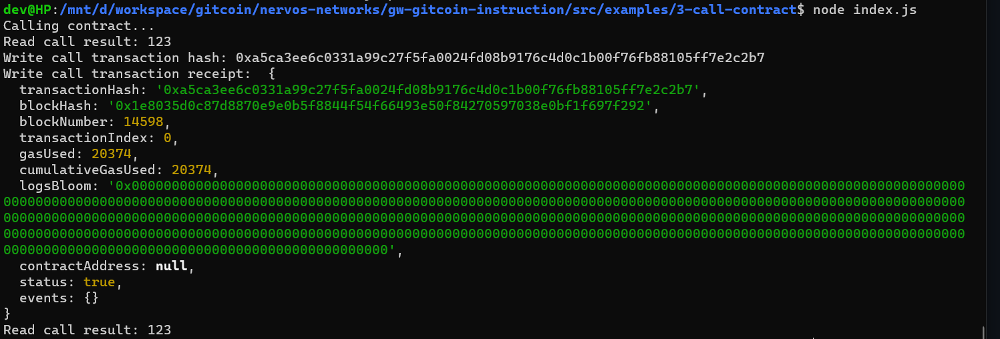

# Issue A Smart Contract Call To The Deployed Smart Contract

Description : https://gitcoin.co/issue/nervosnetwork/grants/4/100026210

## Screenshot of the console output immediately after smart contract call is issued.



## Transaction Hash

```
0xbe967e92e6b21ec083c32b7067bb6f65e67fe6d10de00f4cbaedbf20182c1114
```

## Contract Address

```
0x0dB3613dB98e98aA8eb480965A9f0EbBD0B824D0
```

## Contract ABI

```
[
    {
      "inputs": [],
      "stateMutability": "payable",
      "type": "constructor"
    },
    {
      "inputs": [
        {
          "internalType": "uint256",
          "name": "x",
          "type": "uint256"
        }
      ],
      "name": "set",
      "outputs": [],
      "stateMutability": "payable",
      "type": "function"
    },
    {
      "inputs": [],
      "name": "get",
      "outputs": [
        {
          "internalType": "uint256",
          "name": "",
          "type": "uint256"
        }
      ],
      "stateMutability": "view",
      "type": "function"
    }
  ]
```
