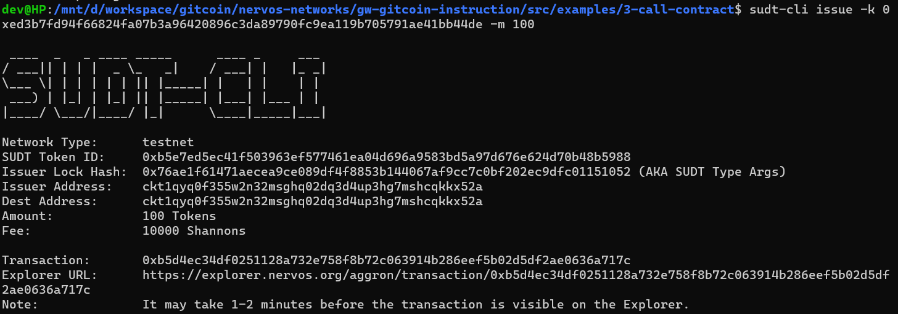
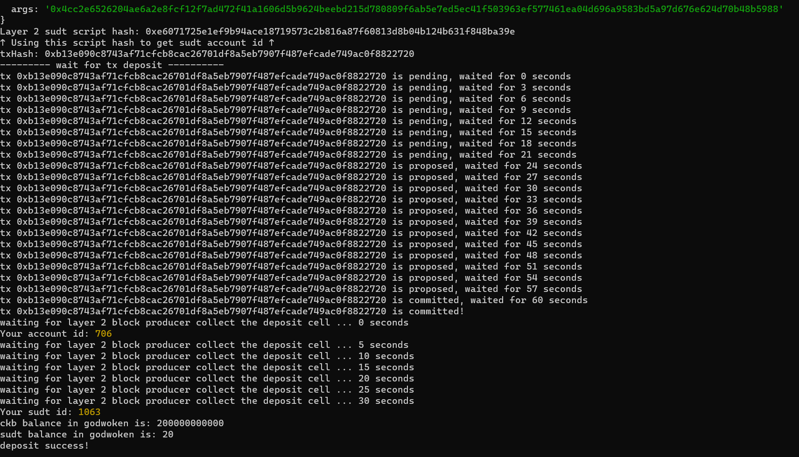

# Issue An SUDT Token On Layer 1 And Deposit It To Layer 2

Task URL : https://gitcoin.co/issue/nervosnetwork/grants/5/100026211

## A link to the Layer 1 address funded on Testnet Explorer

https://explorer.nervos.org/aggron/address/ckt1qyq0f355w2n32msghq02dq3d4up3hg7mshcqkkx52a

## Screenshot of the console output immediately after using sudt-cli to create your SUDT tokens on Layer 1.



## Link to the transaction ID created by sudt-cli on the Testnet Explorer.

https://explorer.nervos.org/aggron/transaction/0xb5d4ec34df0251128a732e758f8b72c063914b286eef5b02d5df2ae0636a717c

## Screenshot of the console output immediately after you have successfully submitted a deposit to Layer 2 using the account-cli tool



## SUDT ID

```

```
