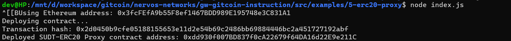
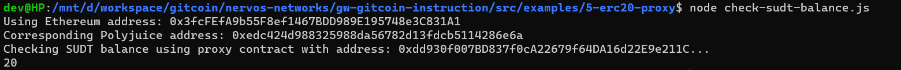
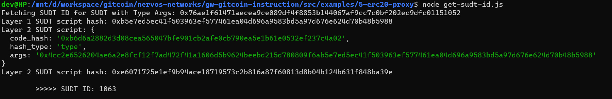

# Deploy The ERC20 Proxy Contract For The Deposited SUDT

Description : https://gitcoin.co/issue/nervosnetwork/grants/6/100026212

## Screenshot after deploying Contract




## Address of the deployed

```
0xdd930f007BD837f0cA22679f64DA16d22E9e211C
```

## Screenshot of the console output immediately after checking SUDT balance




## Ethereum Address

```
0x3fcFEfA9b55F8ef1467BDD989E195748e3C831A1
```

## Layer 1 Issuer Lock Hash

```
0x76ae1f61471aecea9ce089df4f8853b144067af9cc7c0bf202ec9dfc01151052
```

## Screenshot of the console output immediately after fetching SUDT ID




