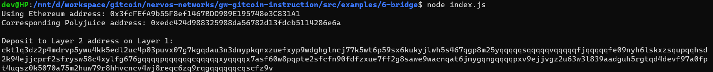

# Use Force Bridge To Deposit Tokens From Ethereum To Polyjuice

Task URL : https://gitcoin.co/issue/nervosnetwork/grants/7/100026213


## A screenshot of the console output immediately after deposit receiver address is successfully generated.




## Your Deposit Receiver Address (in text format).

```
ckt1q3dz2p4mdrvp5ywu4kk5edl2uc4p03puvx07g7kgqdau3n3dmypkqnxzuefxyp9wdghglncj77k5wt6p59sx6kukyjlwh5s467qgp8m25yqqqqqsqqqqqvqqqqqfjqqqqqfe09nyh6lskxzsqupqqhsd2k94ejjcprf2sfrysw58c4xylfg676gqqqqpqqqqqqcqqqqqxyqqqqx7asf60w8pqpte2sfcfn90fdfzxue7ff2g8sawe9wacnqat6jmygqngqqqqpxv9ejjvgz2u63w3l839aadguh5rgtqd4devf97a0fpt4uqsz0k5070a75m2huw79r8hhvcncv4wj8reqc6zq9rqgqqqqqqcqscfz9v
```

## The Ethereum address used to generate the Deposit Receiver Address (in text format).

```
0x3fcFEfA9b55F8ef1467BDD989E195748e3C831A1
```

## A link to the Etherscan explorer for the successful Force Bridge transaction. This can be found on Force Bridge under History→Succeed.

```
https://rinkeby.etherscan.io/tx/0x319ba13e37deeb3f04e230875e0f34fdca3e5e6691f1e5b6dc1a2788aedeb59c
```


## A link to the Nervos explorer for the successful Force bridge transaction. This can be found on Force Bridge under History→Succeed.

```
https://explorer.nervos.org/aggron/transaction/
```


